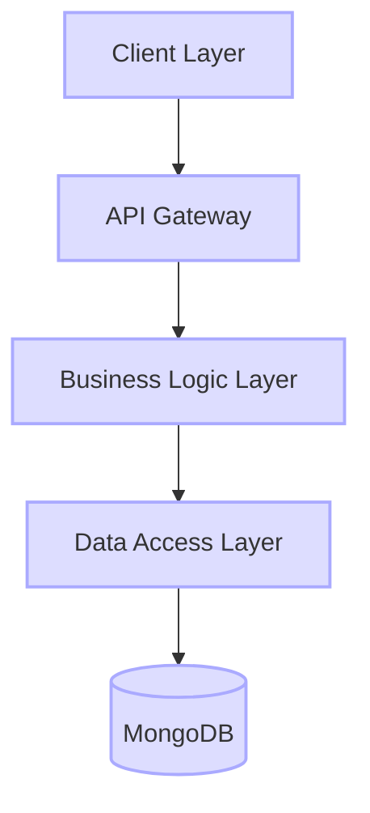

<div align="center">
  
# [4jobs - Professional Networking Platform](https://4jobs.online) 🚀

[](https://4jobs.online)
[](https://nodejs.org/)
[](https://reactjs.org/)
[](https://www.mongodb.com/)
[](https://www.typescriptlang.org/)

<p align="center">
  
</p>

### 🌟 Connecting Talent with Opportunity

A cutting-edge professional networking platform that revolutionizes the job search and recruitment process through intelligent matching and real-time interaction.

</div>

---

## ✨ Key Features

### For Job Seekers 👨‍💼
- 📝 **Smart Resume Builder**
  - Create ATS-optimized resumes with advanced formatting
  - Store multiple versions in your profile
  - One-click sharing with employers
  
- 🎯 **Intelligent Job Matching**
  - Automated matching based on skills and experience
  - Resume parsing for better job recommendations
  - Real-time job alerts

### For Recruiters 👥
- 💼 **Advanced Recruiter Dashboard**
  - Comprehensive candidate search and filtering
  - Skills-based matching algorithm
  - Detailed analytics and reporting

### Platform Features 🛠️
- 💬 **Real-time Communication**
  - Video conferencing integration
  - Live chat functionality
  - Instant notifications

- 🔒 **Security & Authentication**
  - Google OAuth integration
  - Secure payment processing via Razorpay
  - End-to-end data encryption

## 🚀 Technology Stack

### Frontend
```javascript
const frontend = {
  framework: ['React', 'Redux'],
  styling: ['Tailwind CSS', 'Material-UI'],
  realtime: ['Socket.io-client'],
  charting: ['Chart.js'],
  security: ['Crypto-js'],
  utils: ['Axios', 'TypeScript']
}
```

### Backend
```javascript
const backend = {
  runtime: 'Node.js',
  framework: 'Express.js',
  database: 'MongoDB',
  authentication: ['JWT', 'Google Auth'],
  email: 'Nodemailer',
  documentation: 'Swagger',
  architecture: ['Clean Architecture', 'SOLID Principles']
}
```

### DevOps & Deployment
```javascript
const infrastructure = {
  hosting: 'DigitalOcean Droplets',
  webServer: ['Nginx', 'Apache'],
  processManager: 'PM2',
  monitoring: ['New Relic', 'Morgan'],
  cicd: 'GitHub Actions'
}
```

## ⚙️ Environment Configuration

The application requires the following environment variables to be set. Create a `.env` file in the root directory with these configurations:

```typescript
// Server Configuration
PORT=3000                    // Server port number
CLIENT_URL=                  // Frontend application URL

// Database Configuration
DATABASE_URL=                // MongoDB connection string

// JWT Configuration
JWT_SECRET=                  // Secret key for JWT token generation

// Email Configuration (SMTP)
SMTP_HOST=                   // SMTP server host
SMTP_PORT=                   // SMTP server port
SMTP_USER=                   // SMTP username
SMTP_PASS=                   // SMTP password
EMAIL_FROM=                  // Default sender email address

// Google OAuth
GOOGLE_CLIENT_ID=            // Google OAuth client ID

// AWS Configuration
AWS_REGION=                  // AWS region (e.g., us-east-1)
AWS_ACCESS_KEY_ID=          // AWS access key ID
AWS_SECRET_ACCESS_KEY=      // AWS secret access key
S3_BUCKET_NAME=             // AWS S3 bucket name

// Razorpay Payment Gateway
RAZORPAY_KEY_ID=            // Razorpay API key ID
RAZORPAY_SECRET=            // Razorpay API secret key
```

### TypeScript Configuration
The project includes type definitions for environment variables. They are declared globally using:

```typescript
declare global {
  namespace NodeJS {
    interface ProcessEnv {
      SMTP_HOST: string;
      SMTP_PORT: string;
      SMTP_USER: string;
      SMTP_PASS: string;
      EMAIL_FROM: string;
      JWT_SECRET: string;
      DATABASE_URL: string;
      PORT: string;
      GOOGLE_CLIENT_ID: string;
      AWS_REGION: string;
      AWS_ACCESS_KEY_ID: string;
      AWS_SECRET_ACCESS_KEY: string;
      S3_BUCKET_NAME: string;
      RAZORPAY_KEY_ID: string;
      RAZORPAY_SECRET: string;
      CLIENT_URL: string;
    }
  }
}

export {};
```

## 🏗️ Architecture



## 🚀 Getting Started

### Prerequisites
- Node.js >= 14.x
- MongoDB >= 4.4
- npm or yarn
- AWS Account with S3 access
- Razorpay Account
- SMTP Server access

### Installation
```bash
# Clone the repository
git clone https://github.com/yourusername/4jobs.git

# Install dependencies
cd 4jobs
npm install

# Configure environment variables
cp .env.example .env
# Edit .env with your credentials

# Start development server
npm run dev
```

## 📱 Screenshots

<div align="center">
  
  
  
  
</div>

## 🤝 Contributing

1. Fork the Project
2. Create your Feature Branch (`git checkout -b feature/AmazingFeature`)
3. Commit your Changes (`git commit -m 'Add some AmazingFeature'`)
4. Push to the Branch (`git push origin feature/AmazingFeature`)
5. Open a Pull Request

## 📄 License

This project is licensed under the MIT License - see the [LICENSE](LICENSE) file for details.

## 📞 Contact & Support

- Website - [4jobs.online](https://4jobs.online)
- Email - support@4jobs.online
- LinkedIn - [4jobs](https://linkedin.com/company/4jobs)

---

<div align="center">

Made with ❤️ by the 4jobs Team

⭐ Star us on GitHub — it helps!

</div>
